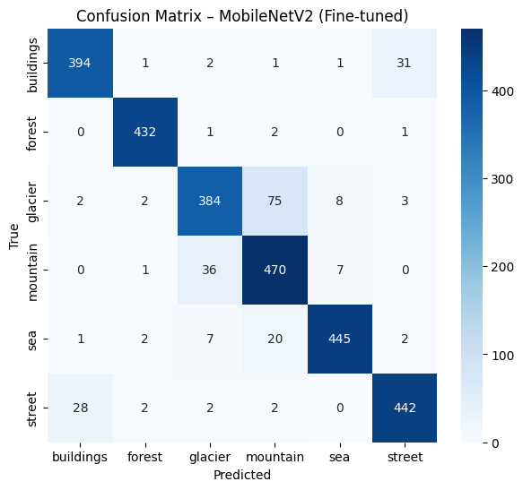

# Intel Image Classification using MobileNetV2

**Transfer Learning • Scene Recognition • 91% Accuracy**

This project classifies natural and urban scene images into 6 categories:

Buildings · Forest · Glacier · Mountain · Sea · Street

Using the publicly available Intel Image Classification Dataset.

## It demonstrates an end-to-end computer vision workflow , from baseline CNN  to transfer learning to fine-tuning to evaluation to deployment-style predictions.

### Highlights & Final Performance

Baseline CNN Model :	81% Validation Accuracy
MobileNetV2 (Frozen)Model :	89% Validation Accuracy
MobileNetV2 (Fine-Tuned) Model : 91% Test Accuracy 

## Evaluation Results
Confusion Matrix - Test Data

## Predictions on Unlabeled Data (seg_pred Dataset)

Below are a few predictions made by the model during real-world deployment testing:

| Sample Image | Prediction |
|-------------|-----------|
|  | sea |
|  | mountain |
|  | street |
|  | forest |
|  | buildings |
|  | glacier |

Full predictions are saved into class-sorted folders and exported as submission.csv.

**In the Repository Dataset not included (large size). Follow instructions below to download.**

## Dataset

Intel Image Classification — Kaggle: https://www.kaggle.com/datasets/puneet6060/intel-image-classification

Download and extract:

* seg_train
* seg_test
* seg_pred

Update the path in the notebook:

base_dir = "/content/drive/MyDrive/intel_cv_project"

Run This Project Yourself:

Clone the repo -

git clone https://github.com/rubinaalmas/intel-image-classification.git
cd intel-image-classification

Install dependencies:

pip install -r requirements.txt

Run the notebook

Execute cells step-by-step in Google Colab / Jupyter Notebook

Tech Stack:

1. TensorFlow / Keras
2. Python, NumPy, pandas
3. Matplotlib, Seaborn
4. Scikit-learn for evaluation

Future Improvements

➡ Try EfficientNet-B0/B3 for higher feature richness
➡ Deploy model as a web or mobile app for user exploration

👩‍💻 Author

Created by Rubina Almas
📍 Machine Learning & Data Science Enthusiast
🔗 GitHub: https://github.com/rubinaalmas
